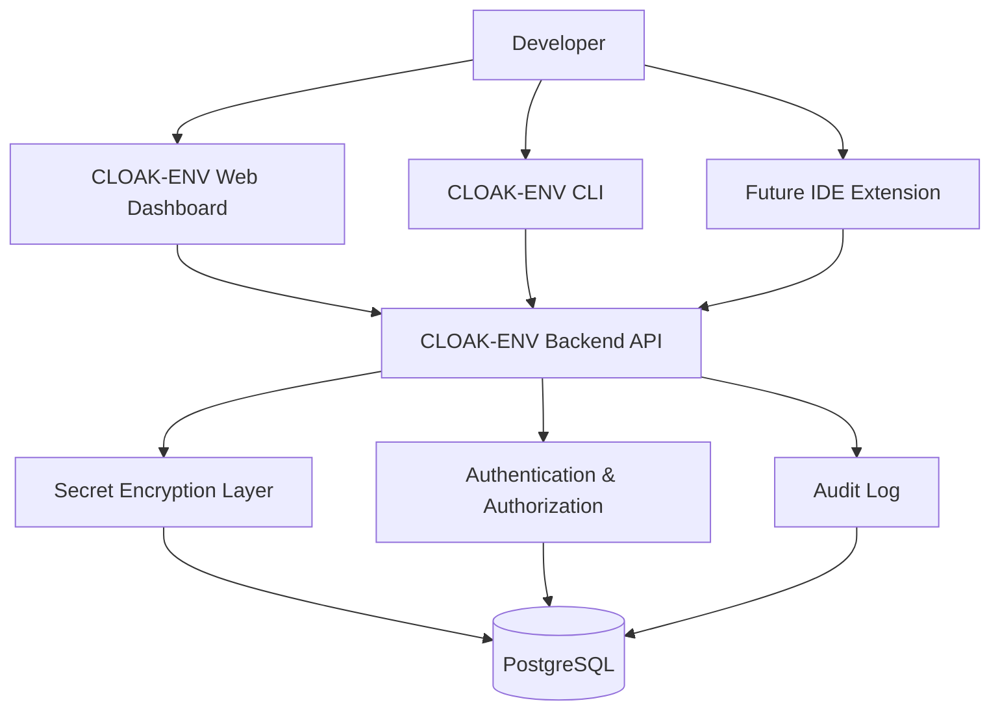
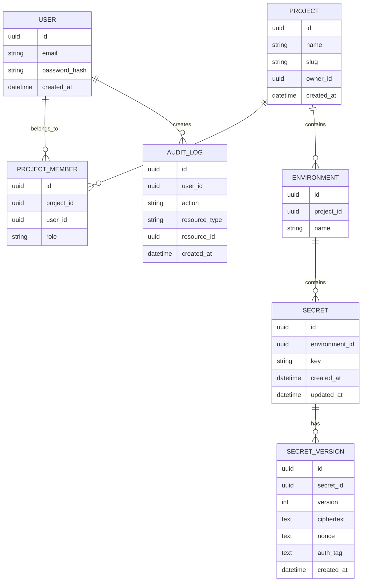
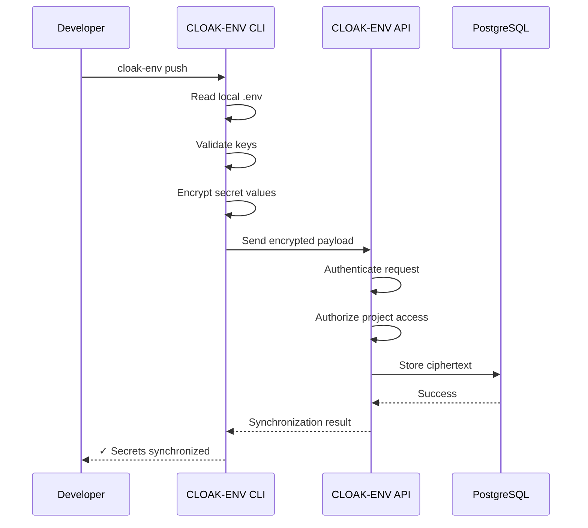
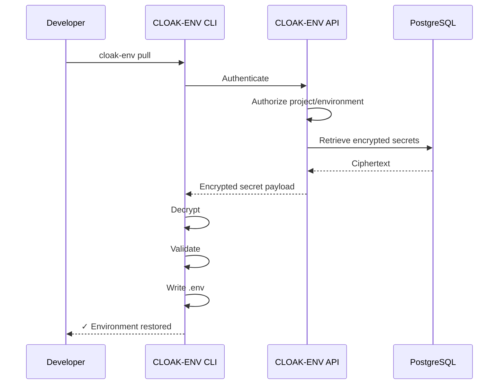
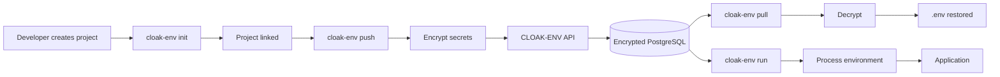
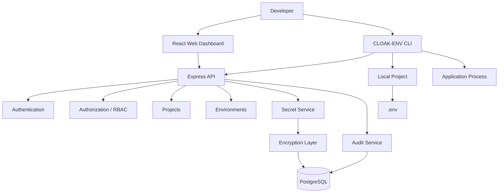

# CLOAK-ENV — Secure Developer Secret Vault

> **CLOAK-ENV** is a developer-focused cloud secret management and synchronization platform for securely storing, restoring, and using project environment variables without committing `.env` files to GitHub.

**Tagline:** Your secrets. Your projects. Anywhere you code.

---

## 1. Project Overview

Developers commonly store sensitive configuration in files such as:

- `.env`
- `.env.local`
- `.env.development`
- `.env.production`

These files may contain:

```env
DATABASE_URL=...
MONGODB_URI=...
JWT_SECRET=...
API_KEY=...
FIREBASE_PRIVATE_KEY=...
AWS_ACCESS_KEY_ID=...
AWS_SECRET_ACCESS_KEY=...
```

These values should generally **not** be committed to public or shared Git repositories.

This creates a practical problem:

1. A developer creates a project.
2. Secrets exist only on their local machine and/or deployment provider.
3. The `.env` file is intentionally excluded from Git.
4. The laptop is lost, damaged, reformatted, or replaced.
5. The Git repository contains the application code but not the secrets.
6. Deployment dashboards may intentionally hide secret values after they are entered.
7. The developer must reconstruct the environment manually.

**CLOAK-ENV solves this by making the encrypted cloud vault the source of truth for development secrets.**

A developer can:

```bash
cloak-env init
cloak-env push
cloak-env pull
cloak-env run npm run dev
```

The project should provide:

- A web dashboard
- A secure backend API
- A CLI
- Encrypted secret storage
- Project/environment organization
- Authentication
- Access control
- Secret versioning
- Audit logging
- Safe `.env` restoration
- Optional process-level secret injection
- A path toward GitHub, Vercel, Render, CI/CD, and IDE integrations

---

# 2. Important Positioning

CLOAK-ENV is **not** simply "cloud storage for `.env` files."

The stronger concept is:

> **CLOAK-ENV is a centralized, encrypted source of truth for application secrets.**

The intended model is:

```text
                         CLOAK-ENV
                  Encrypted Source of Truth
                         /   |   \
                        /    |    \
                       /     |     \
                 Laptop   CI/CD   Deployment
                   |
                 CLI
                   |
              Local Project
```

A `.env` file becomes a **local representation/cache** of secrets rather than the primary source.

---

# 3. Problem Statement

## Current workflow

```text
Developer
   |
   +--> .env
   |
   +--> GitHub
   |       |
   |       +--> Code
   |       +--> .gitignore excludes .env
   |
   +--> Vercel environment variables
   |
   +--> Render environment variables
   |
   +--> Other machines
```

The developer can easily end up with multiple sources of configuration.

If the local machine disappears:

```text
Laptop
  |
  +--> .env
  |
  X
```

The code survives in GitHub, but the local secrets may not.

## CLOAK-ENV workflow

```text
                         ┌──────────────────────┐
                         │       CLOAK-ENV         │
                         │ Encrypted Secret     │
                         │ Vault                │
                         └──────────┬───────────┘
                                    │
                ┌───────────────────┼──────────────────┐
                │                   │                  │
                ▼                   ▼                  ▼
             Laptop             CI/CD             Deployment
                │
                ▼
          Local Project
```

---

# 4. Project Goals

## Primary goals

- Securely store application secrets.
- Encrypt secrets before persistent storage.
- Allow developers to restore secrets on a new machine.
- Provide a simple CLI.
- Support multiple projects.
- Support multiple environments.
- Prevent accidental secret exposure.
- Provide authentication and authorization.
- Keep an audit trail of security-sensitive actions.
- Make local development simple.

## Secondary goals

- Secret versioning.
- Secret rotation workflows.
- Team/project sharing.
- Deployment integrations.
- GitHub integration.
- Vercel integration.
- Render integration.
- CI/CD integration.
- VS Code extension.
- Docker integration.

---

# 5. Non-Goals for the First Version

Do **not** attempt to build everything immediately.

V1 should not require:

- Kubernetes
- Microservices
- Kafka
- Complex distributed infrastructure
- Automatic secret scanning everywhere
- Full enterprise IAM
- Automatic deployment to every cloud
- A VS Code extension
- Native mobile apps

The first production-grade student version should focus on:

```text
Web Dashboard
      +
Backend API
      +
CLI
      +
Encrypted Secret Storage
      +
Authentication
      +
Authorization
      +
Audit Logs
```

---

# 6. Recommended Tech Stack

## Frontend

- React
- TypeScript
- Vite
- Tailwind CSS
- React Router
- Zod for client-side validation where appropriate
- Fetch or Axios for API communication

## Backend

- Node.js
- TypeScript
- Express
- Zod
- Prisma
- PostgreSQL

## CLI

- Node.js
- TypeScript
- Commander.js or similar CLI framework
- `prompts` / `inquirer` for interactive commands
- Native `fetch` or Axios
- `dotenv` only where local `.env` parsing is required
- `child_process` for `cloak-env run`

## Security

- Node.js `crypto`
- AES-256-GCM for authenticated encryption
- Argon2id for password hashing
- Cryptographically secure random values
- Short-lived access tokens
- Rotating refresh tokens
- TLS/HTTPS
- Rate limiting
- Secure HTTP headers
- Strict CORS configuration
- Input validation
- Audit logs

## Database

- PostgreSQL
- Prisma ORM

## Hosting

Possible development deployment:

```text
Frontend → Vercel
Backend  → Render / Railway
Database → Neon / Supabase PostgreSQL
```

The hosting provider is replaceable. CLOAK-ENV should not depend on one provider.

## Source Control

- Git
- GitHub

---

# 7. Why PostgreSQL?

The data model is highly relational:

```text
User
 |
 +--- Project
       |
       +--- Environment
       |      |
       |      +--- Secret
       |
       +--- ProjectMember
```

PostgreSQL is therefore a strong fit.

MongoDB could also work, but PostgreSQL + Prisma provides:

- Strong relationships
- Constraints
- Transactions
- Migrations
- Referential integrity
- Good audit-log modeling

---

# 8. High-Level Architecture



---

# 9. Recommended Repository Structure

A monorepo is recommended.

```text
cloak-env/
│
├── apps/
│   ├── web/
│   │   ├── src/
│   │   ├── public/
│   │   └── package.json
│   │
│   └── api/
│       ├── src/
│       │   ├── controllers/
│       │   ├── routes/
│       │   ├── middleware/
│       │   ├── services/
│       │   ├── crypto/
│       │   ├── auth/
│       │   └── server.ts
│       └── package.json
│
├── packages/
│   └── cli/
│       ├── src/
│       │   ├── commands/
│       │   ├── api/
│       │   ├── auth/
│       │   ├── config/
│       │   └── index.ts
│       └── package.json
│
├── packages/
│   └── shared/
│       ├── src/
│       └── package.json
│
├── prisma/
│   ├── schema.prisma
│   └── migrations/
│
├── docs/
│
├── .gitignore
├── package.json
├── README.md
└── LICENSE
```

---

# 10. Core Concepts

CLOAK-ENV has four important concepts.

## 10.1 User

A person using CLOAK-ENV.

```text
User
- id
- email
- passwordHash
- createdAt
- updatedAt
```

Never store a plaintext password.

---

## 10.2 Project

A software project.

Example:

```text
Club Connect
FoodLane
ChatFold
My Portfolio
```

---

## 10.3 Environment

A project can have several environments:

```text
development
staging
production
testing
```

Example:

```text
Club Connect
│
├── development
├── staging
└── production
```

---

## 10.4 Secret

A key/value pair.

```text
MONGODB_URI = ...
JWT_SECRET = ...
FIREBASE_API_KEY = ...
```

The value is encrypted before persistent storage.

---

# 11. Example Data Model



---

# 12. CLI Commands

The CLI is one of the most important parts of CLOAK-ENV.

The executable can be:

```bash
cloak-env
```

The npm package could eventually be published as:

```bash
npm install -g cloak-env
```

---

## 12.1 `cloak-env login`

### Purpose

Authenticate the CLI with the CLOAK-ENV account.

```bash
cloak-env login
```

Example:

```text
CLOAK-ENV Login

Email: developer@example.com
Password: ********

✓ Authentication successful
✓ CLI authenticated
```

The CLI should not store the user's password.

A secure token/session mechanism should be used.

---

# 13. `cloak-env init`

### Purpose

Connect the current local directory to a CLOAK-ENV project/environment.

```bash
cloak-env init
```

Example:

```text
$ cloak-env init

Select project:
> Club Connect

Select environment:
> development

✓ Project connected
✓ Environment connected
```

CLOAK-ENV can create a local metadata directory such as:

```text
.cloak-env/
    config.json
```

Example:

```json
{
  "projectId": "project-id",
  "environmentId": "environment-id"
}
```

This file must contain **metadata only**.

Never put secrets in `.cloak-env/config.json`.

---

# 14. `cloak-env push`

### Purpose

Upload local environment variables to CLOAK-ENV.

```bash
cloak-env push
```

Possible workflow:

```text
Reading .env...

Found:

MONGODB_URI
JWT_SECRET
FIREBASE_API_KEY

Upload these secrets?
[y/N]
```

After confirmation:

```text
Encrypting...
Uploading...

✓ MONGODB_URI
✓ JWT_SECRET
✓ FIREBASE_API_KEY

3 secrets synchronized.
```

The local plaintext values should be encrypted before persistent storage.

---

# 15. `cloak-env pull`

### Purpose

Restore secrets from CLOAK-ENV into the local environment.

```bash
cloak-env pull
```

Example:

```text
Fetching environment: development

✓ MONGODB_URI
✓ JWT_SECRET
✓ FIREBASE_API_KEY

Write secrets to .env?
[y/N]
```

After confirmation:

```text
✓ .env restored
```

The CLI should ensure `.env` is included in `.gitignore`.

It should also warn if the user appears to be about to commit secrets.

---

# 16. `cloak-env run`

### Purpose

Run an application with secrets injected into its process environment.

Example:

```bash
cloak-env run npm run dev
```

Conceptually:

```text
CLOAK-ENV
   |
   | Fetch encrypted secrets
   ↓
Decrypt in authorized client context
   |
   ↓
Process environment
   |
   ↓
npm run dev
```

The application can still access:

```javascript
process.env.MONGODB_URI
```

without requiring the value to be written to `.env`.

This is potentially one of CLOAK-ENV's strongest developer-experience features.

---

# 17. Important Difference: `pull` vs `run`

## `pull`

```bash
cloak-env pull
```

Creates/restores:

```text
.env
```

Useful when the developer wants a traditional local environment.

## `run`

```bash
cloak-env run npm run dev
```

Provides secrets to the running process.

Useful when the developer wants to minimize plaintext secret files on disk.

---

# 18. Additional Future CLI Commands

Potential future commands:

```bash
cloak-env projects
cloak-env env
cloak-env secrets
cloak-env set KEY
cloak-env get KEY
cloak-env delete KEY
cloak-env history
cloak-env rollback
cloak-env rotate
cloak-env team
cloak-env members
cloak-env deploy
```

Example:

```bash
cloak-env set JWT_SECRET
```

could prompt:

```text
Enter value:
********

✓ Secret stored
```

---

# 19. Secret Synchronization Flow



---

# 20. Restore Flow



The exact encryption architecture must be finalized before implementation. For a stronger zero-knowledge design, the server should not possess the user's plaintext secret values or the key required to decrypt them.

---

# 21. Security Requirements

This project handles extremely sensitive information.

Security is not an optional feature.

Treat the following as potentially sensitive:

- Database URLs
- API keys
- OAuth secrets
- JWT signing keys
- Private keys
- Cloud credentials
- Service account credentials
- Payment provider keys
- Encryption keys

---

# 22. Never Store Plaintext Secrets

Bad:

```text
Database:

MONGODB_URI = mongodb+srv://...
JWT_SECRET = mysecret
```

Good:

```text
Database:

secret_id
ciphertext
nonce
authentication_tag
version
```

The exact key-management design should be documented and tested before production use.

---

# 23. Authenticated Encryption

Use an authenticated encryption mode such as:

```text
AES-256-GCM
```

Why GCM?

It provides:

- Confidentiality
- Integrity/authentication
- Detection of ciphertext tampering

Conceptually:

```text
Plaintext
    +
Encryption Key
    +
Random Nonce
    ↓
AES-256-GCM
    ↓
Ciphertext + Auth Tag
```

The nonce must be unique for each encryption operation under the same key.

Use a cryptographically secure random generator.

---

# 24. Password Security

Never do:

```text
password → SHA256 → database
```

Use a password hashing algorithm designed for passwords:

```text
Argon2id
```

Store:

```text
passwordHash
```

Never:

```text
password
```

---

# 25. Authentication

Recommended:

```text
Web
 ↓
Login
 ↓
Short-lived access token
 +
Secure refresh-token mechanism
```

For browser sessions, prefer secure cookie-based session/refresh handling where practical.

For CLI authentication, use a device/login flow or another mechanism that does not require storing the user's password locally.

---

# 26. Authorization

Authentication answers:

> Who are you?

Authorization answers:

> Are you allowed to access this secret?

Every secret request must verify:

```text
User
 ↓
Project membership
 ↓
Environment permission
 ↓
Secret access
```

Never rely solely on:

```text
projectId
```

sent by the client.

The backend must independently verify ownership/membership and permissions.

---

# 27. Role-Based Access Control

Potential roles:

```text
OWNER
ADMIN
DEVELOPER
VIEWER
```

Example:

```text
Production
│
├── Owner      → full access
├── Admin      → manage secrets
├── Developer  → controlled access
└── Viewer     → metadata/read-only where appropriate
```

Production secrets should have stricter controls than development secrets.

---

# 28. Audit Logging

Security-sensitive actions should be recorded.

Examples:

```text
USER_LOGIN
PROJECT_CREATED
SECRET_CREATED
SECRET_UPDATED
SECRET_DELETED
SECRET_ACCESSED
SECRET_VERSION_CREATED
MEMBER_ADDED
MEMBER_REMOVED
ENVIRONMENT_CREATED
CLI_AUTHENTICATED
```

Do **not** put secret values inside audit logs.

Good:

```text
User updated secret "MONGODB_URI"
```

Bad:

```text
User updated MONGODB_URI to mongodb+srv://username:password...
```

---

# 29. Logging Rules

Never log:

```text
Authorization headers
Access tokens
Refresh tokens
Passwords
Secret values
Private keys
Encryption keys
```

Avoid accidental logging such as:

```javascript
console.log(req.body);
```

if `req.body` can contain secrets.

Use structured logging and explicit redaction.

---

# 30. HTTPS

All communication must use HTTPS in deployed environments.

Never send secrets over plain HTTP in production.

```text
CLI
 |
 | HTTPS
 ↓
CLOAK-ENV API
```

---

# 31. API Security

The API should implement:

- Authentication
- Authorization
- Input validation
- Rate limiting
- Request size limits
- Secure HTTP headers
- CORS restrictions
- Error sanitization
- Audit logging
- Abuse protection

Use Zod or equivalent validation for incoming data.

---

# 32. CORS

Do not use:

```javascript
cors({
    origin: "*"
})
```

for authenticated production APIs unless there is a carefully justified reason.

Instead configure allowed origins explicitly.

Example:

```text
https://cloak-env.example.com
```

---

# 33. Rate Limiting

Especially protect:

```text
/login
/refresh
/cli-auth
/secrets
```

from brute-force and abuse.

Use a rate limiter and sensible limits.

---

# 34. Secret Exposure in the Web Dashboard

The dashboard should avoid showing secret values by default.

Instead:

```text
MONGODB_URI
••••••••••••••••
```

Potential actions:

```text
Reveal
Copy
Edit
Delete
History
```

Revealing/copying should be treated as sensitive actions and can optionally require re-authentication.

---

# 35. Encryption Key Management

This is one of the hardest parts of the project.

Do not casually put:

```env
ENCRYPTION_KEY=...
```

into the same database that stores encrypted secrets.

For a learning implementation, you can start with a server-side master key stored outside the database, such as a protected deployment secret.

However, for a stronger production architecture, move toward:

```text
Key Encryption Key
        ↓
Data Encryption Keys
        ↓
Encrypted Secrets
```

A more advanced design can use envelope encryption:

```text
Master/Key Encryption Key
          ↓
     encrypts/unwraps
          ↓
    Data Encryption Key
          ↓
     encrypts secret
          ↓
      Ciphertext
```

For serious production use, a managed KMS/HSM should be considered.

---

# 36. Zero-Knowledge Direction

A highly advanced future architecture is:

```text
                    Client
                       |
              Encrypt / Decrypt
                       |
                       ↓
                   CLOAK-ENV API
                       |
                       ↓
              Encrypted Database
```

The backend stores ciphertext but cannot decrypt it.

Advantages:

- Reduced server-side plaintext exposure
- Stronger privacy model
- Database compromise does not directly expose plaintext

Challenges:

- Key recovery
- Password changes
- Device recovery
- Team sharing
- Secret rotation
- Multi-device synchronization
- Lost credentials

Therefore, do not implement a zero-knowledge architecture casually. Design the cryptographic protocol first.

---

# 37. Disaster Recovery

The original problem of CLOAK-ENV is partly disaster recovery.

Example:

```text
Laptop A
   |
   └── .env
       |
       ↓
    cloak-env push
       |
       ↓
Encrypted Cloud Vault
       |
       X
Laptop A destroyed
       |
       ↓
Laptop B
       |
       ↓
cloak-env login
       |
       ↓
cloak-env pull
       |
       ↓
.env restored
```

However, the cloud backup is only useful if the developer can still recover the necessary authentication/decryption credentials.

Therefore, recovery design must be treated as a first-class feature.

---

# 38. `.gitignore` Protection

When `cloak-env init` or `cloak-env pull` creates a `.env`, CLOAK-ENV should verify `.gitignore`.

Recommended:

```gitignore
.env
.env.*
!.env.example
```

Be careful with project-specific conventions.

CLOAK-ENV should warn rather than silently modify files without user awareness.

---

# 39. `.env.example`

Developers can safely commit:

```env
MONGODB_URI=
JWT_SECRET=
FIREBASE_API_KEY=
```

as a template.

Never put real secret values in `.env.example`.

CLOAK-ENV can potentially generate/update this file in a future version.

---

# 40. Secret Versioning

Every update can create a new version.

Example:

```text
JWT_SECRET

Version 1
Version 2
Version 3 ← current
```

Possible command:

```bash
cloak-env history JWT_SECRET
```

Output:

```text
v3   Current
v2   2026-09-20
v1   2026-09-10
```

Future command:

```bash
cloak-env rollback JWT_SECRET --version 2
```

---

# 41. Secret Rotation

A secret should sometimes be rotated.

Example:

```text
Old API key
    ↓
Create new API key
    ↓
Store new version
    ↓
Deploy/update consumers
    ↓
Revoke old API key
```

CLOAK-ENV can eventually provide a rotation workflow.

Do not automatically rotate external credentials unless the integration is explicitly designed to do so.

---

# 42. Team Sharing

A future project can support:

```text
Project
│
├── Owner
├── Admin
├── Developer
└── Viewer
```

Team members should receive permissions, not shared master passwords.

---

# 43. Future Deployment Integrations

Possible future integrations:

```text
CLOAK-ENV
 ├── GitHub
 ├── Vercel
 ├── Render
 ├── Railway
 ├── AWS
 ├── Docker
 └── CI/CD
```

For example:

```text
cloak-env deploy vercel
```

could eventually synchronize selected environment variables with a deployment platform.

This should be added only after the core vault is secure and stable.

---

# 44. Future VS Code Extension

Possible experience:

```text
VS Code
│
├── CLOAK-ENV
│   ├── Project
│   ├── Development
│   ├── Staging
│   └── Production
```

Commands:

```text
CLOAK-ENV: Login
CLOAK-ENV: Initialize Project
CLOAK-ENV: Pull Secrets
CLOAK-ENV: Push Secrets
CLOAK-ENV: Run With Secrets
```

Do not automatically upload `.env` files without explicit user action.

---

# 45. Why Automatic `.env` Upload Is Dangerous

Avoid:

```text
Extension starts
      ↓
Finds .env
      ↓
Automatically uploads it
```

A developer may have:

```text
.env
.env.local
.env.production
```

with credentials they never intended to upload.

Better:

```text
Detected .env

CLOAK-ENV found 7 possible secret variables.

Upload to:
development

[Review] [Cancel]
```

Explicit consent is safer.

---

# 46. API Design

Potential endpoints:

## Authentication

```text
POST /api/auth/register
POST /api/auth/login
POST /api/auth/refresh
POST /api/auth/logout
```

## Projects

```text
GET    /api/projects
POST   /api/projects
GET    /api/projects/:id
PATCH  /api/projects/:id
DELETE /api/projects/:id
```

## Environments

```text
GET    /api/projects/:projectId/environments
POST   /api/projects/:projectId/environments
PATCH  /api/environments/:id
DELETE /api/environments/:id
```

## Secrets

```text
GET    /api/environments/:environmentId/secrets
POST   /api/environments/:environmentId/secrets
PATCH  /api/secrets/:id
DELETE /api/secrets/:id
GET    /api/secrets/:id/versions
```

## CLI synchronization

```text
POST /api/sync/push
POST /api/sync/pull
```

The exact API should be designed around authorization and minimizing secret exposure.

---

# 47. Web Dashboard Pages

Recommended initial pages:

```text
/
├── Landing
├── Login
├── Register
├── Dashboard
├── Projects
│   └── Project Details
│       ├── Development
│       ├── Staging
│       └── Production
├── Secrets
├── Secret History
├── Team
├── Audit Logs
└── Settings
```

---

# 48. Dashboard Example

```text
┌──────────────────────────────────────────────┐
│ CLOAK-ENV                         Account       │
├──────────────┬───────────────────────────────┤
│ Dashboard    │ Club Connect                  │
│ Projects     │                               │
│ Teams        │ Environment: Development     │
│ Audit Logs   │                               │
│ Settings     │ MONGODB_URI       •••••••••  │
│              │ JWT_SECRET        •••••••••  │
│              │ FIREBASE_API_KEY  •••••••••  │
│              │                               │
│              │ [Add Secret]                  │
└──────────────┴───────────────────────────────┘
```

---

# 49. Development Workflow

A developer starts with:

```bash
git clone ...
cd project
npm install
```

Then:

```bash
npm install -g cloak-env
```

Login:

```bash
cloak-env login
```

Initialize:

```bash
cloak-env init
```

If secrets already exist locally:

```bash
cloak-env push
```

On another machine:

```bash
cloak-env login
cloak-env init
cloak-env pull
npm run dev
```

Or:

```bash
cloak-env run npm run dev
```

---

# 50. New Laptop Scenario

This is the primary demonstration scenario.

### Old laptop

```bash
cloak-env push
```

Result:

```text
✓ 12 secrets synchronized
```

### Laptop fails

The GitHub repository remains safe because it contains code, not `.env`.

### New laptop

```bash
git clone <repository>
cd project
npm install
npm install -g cloak-env
cloak-env login
cloak-env init
cloak-env pull
```

Result:

```text
✓ Environment restored
```

The developer can continue working.

---

# 51. Security Threat Model

Threats CLOAK-ENV should consider:

## Threat 1 — Database leak

Attacker obtains database contents.

Defense:

- Encrypt secret values
- Strong key management
- No plaintext secret storage

## Threat 2 — Stolen access token

Defense:

- Short-lived access tokens
- Refresh token rotation
- Revocation
- Device/session management

## Threat 3 — Brute-force login

Defense:

- Argon2id
- Rate limiting
- Account protections
- Optional MFA later

## Threat 4 — Unauthorized project access

Defense:

- Server-side authorization
- Project membership checks
- RBAC
- Environment permissions

## Threat 5 — Secret accidentally committed

Defense:

- `.gitignore` checks
- Secret scanning
- CLI warnings
- `.env.example` support

## Threat 6 — Logs leak secrets

Defense:

- Redaction
- Structured logging
- Never log request bodies containing secrets

## Threat 7 — XSS

Defense:

- React escaping
- CSP
- Secure headers
- Avoid dangerous HTML rendering

## Threat 8 — SQL injection

Defense:

- Prisma parameterization
- Input validation
- No unsafe raw SQL without strong justification

## Threat 9 — CSRF

Defense:

- Appropriate cookie/session architecture
- SameSite cookies
- CSRF protection where applicable

## Threat 10 — Compromised client

Important limitation:

If the developer's machine is already compromised, an attacker may access secrets while they are being used.

CLOAK-ENV cannot magically protect secrets from a fully compromised endpoint.

---

# 52. Security Principle

The core rule should be:

> **Minimize plaintext secret exposure.**

That means:

```text
Encrypt at rest
+
HTTPS in transit
+
Do not log secrets
+
Do not store passwords
+
Do not commit secrets
+
Strict authorization
+
Minimal secret exposure
+
Audit sensitive actions
```

---

# 53. What CLOAK-ENV Should Never Do

Never:

- Store plaintext passwords
- Store plaintext secret values unnecessarily
- Log secret values
- Log access tokens
- Put encryption keys in GitHub
- Put production credentials in frontend code
- Expose secret values through public APIs
- Return all project secrets when one is requested
- Trust client-provided project ownership
- Automatically upload every `.env` file
- Put secrets in URLs/query parameters
- Put secrets in analytics events
- Put secrets in error messages
- Commit `.env` files

---

# 54. Frontend Security Rule

The React frontend is **not a trusted secret-storage environment**.

Never put:

```text
DATABASE_PASSWORD
JWT_SIGNING_SECRET
PRIVATE_API_KEY
ENCRYPTION_MASTER_KEY
```

inside:

```text
VITE_*
```

or frontend source code.

Anything bundled into a browser application should be considered visible to the user.

---

# 55. Environment Variables for CLOAK-ENV Itself

CLOAK-ENV's backend will have its own environment variables.

For example:

```env
DATABASE_URL=...
JWT_SECRET=...
REFRESH_TOKEN_SECRET=...
ENCRYPTION_KEY=...
```

These should **not** be committed to GitHub.

For development:

```text
local .env
```

For deployment:

```text
Render/Vercel/etc. environment configuration
```

For CLOAK-ENV's own production deployment, use an appropriate secure secret-management mechanism.

---

# 56. Development Environment

Recommended:

```text
Node.js LTS
npm
Git
VS Code
PostgreSQL
Postman/Insomnia
```

Optional:

```text
Docker
Docker Compose
```

Docker can make local PostgreSQL setup easier.

---

# 57. Development Phases

## Phase 1 — Planning

Create:

```text
Architecture
Database schema
API specification
Security model
CLI command specification
```

Do this before writing the main code.

---

## Phase 2 — Backend Foundation

Build:

```text
Express
TypeScript
Prisma
PostgreSQL
Error handling
Validation
Configuration
```

---

## Phase 3 — Authentication

Implement:

```text
Register
Login
Logout
Token/session handling
Password hashing
```

---

## Phase 4 — Project Management

Implement:

```text
Create project
List projects
Get project
Update project
Delete project
```

---

## Phase 5 — Environment Management

Implement:

```text
Create environment
List environments
Update environment
Delete environment
```

---

## Phase 6 — Secret Management

Implement:

```text
Create secret
Read metadata
Update secret
Delete secret
Version secret
```

Encryption must be implemented before real secrets are used.

---

## Phase 7 — Web Dashboard

Build:

```text
Login
Dashboard
Projects
Environments
Secrets
Secret history
Settings
```

---

## Phase 8 — CLI

Implement:

```text
cloak-env login
cloak-env init
cloak-env push
cloak-env pull
cloak-env run
```

---

## Phase 9 — Security Hardening

Test:

```text
Authentication
Authorization
Encryption
Rate limits
CORS
CSRF
XSS
Input validation
Audit logs
Secret leakage
```

---

## Phase 10 — Deployment

Deploy:

```text
Frontend → Vercel
Backend → Render/Railway
Database → Neon/Supabase
```

Configure production secrets securely.

---

# 58. Testing Strategy

Test the backend with:

- Unit tests
- Integration tests
- API tests

Important tests:

```text
Can user register?
Can user login?
Can user create project?
Can user access own project?
Can user NOT access another user's project?
Can user create secret?
Is secret encrypted?
Can user retrieve authorized secret?
Can unauthorized user retrieve secret?
Does logout invalidate session?
Does secret deletion work?
Does versioning work?
```

CLI tests:

```text
login
init
push
pull
run
invalid credentials
invalid project
missing .env
malformed .env
network failure
expired authentication
```

---

# 59. Critical Security Tests

These tests are especially important:

### Test 1

Create:

```text
JWT_SECRET=super-secret
```

Push it.

Inspect the database.

Expected:

```text
super-secret
```

must **not** appear in plaintext.

### Test 2

Search application logs.

Expected:

```text
super-secret
```

must not appear.

### Test 3

Try accessing another user's project.

Expected:

```text
403 Forbidden
```

or an appropriately designed authorization response.

### Test 4

Try invalid/expired CLI authentication.

Expected:

```text
Authentication failed
```

without exposing sensitive details.

---

# 60. Example End-to-End Flow



---

# 61. Full System Flow



---

# 62. Suggested V1 Feature Set

The V1 definition of done:

```text
✓ User registration
✓ User login
✓ Secure password hashing
✓ Project creation
✓ Environment creation
✓ Secret creation
✓ Secret encryption
✓ Secret update
✓ Secret deletion
✓ Secret versioning
✓ Audit logging
✓ Web dashboard
✓ CLI authentication
✓ cloak-env init
✓ cloak-env push
✓ cloak-env pull
✓ cloak-env run
✓ .gitignore protection
✓ Authorization
✓ Rate limiting
✓ HTTPS deployment
✓ Basic security testing
```

---

# 63. V2 Feature Set

```text
Team collaboration
Role-based access
MFA
Secret rotation
Better recovery
Project invitations
Deployment integrations
GitHub integration
CI/CD integration
```

---

# 64. V3 Feature Set

```text
VS Code extension
Vercel integration
Render integration
Docker integration
Cloud provider integrations
Advanced zero-knowledge architecture
KMS/HSM integration
Enterprise audit controls
```

---

# 65. Example User Experience

A new developer starts:

```bash
npm install -g cloak-env
```

Then:

```bash
cloak-env login
```

Then:

```bash
cd my-project
cloak-env init
```

They select:

```text
Project:
My Portfolio

Environment:
development
```

They already have:

```text
.env
```

They run:

```bash
cloak-env push
```

CLOAK-ENV asks for confirmation.

Secrets are encrypted and synchronized.

Later, they buy a new laptop.

```bash
git clone <repo>
cd my-project
npm install
npm install -g cloak-env
cloak-env login
cloak-env init
cloak-env pull
npm run dev
```

Their environment is restored.

Or:

```bash
cloak-env run npm run dev
```

and the application receives its secrets without requiring a persistent `.env` file.

---

# 66. Core Product Philosophy

CLOAK-ENV should follow these principles:

### 1. Security first

A feature should not be added if it creates unnecessary secret exposure.

### 2. Explicit user control

Do not silently upload or reveal secrets.

### 3. Minimal trust

The client, API, database, and deployment platform should each have clearly defined trust boundaries.

### 4. Least privilege

Users and services should receive only the access they need.

### 5. Recoverability

A developer should be able to recover project configuration after losing a machine, subject to secure authentication/key recovery.

### 6. Developer experience

Security should not require dozens of complicated commands.

---

# 67. CLOAK-ENV's Core Value Proposition

The project can be summarized as:

> **CLOAK-ENV is a secure cloud vault for developer environment variables and application secrets. It provides encrypted storage, project/environment organization, CLI-based synchronization, secret recovery, and process-level secret injection so developers can move between machines without committing sensitive configuration to source control.**

---

# 68. One-Line Architecture

```text
React Dashboard + Node/Express API + PostgreSQL + Encryption + TypeScript CLI
```

---

# 69. One-Line Workflow

```text
init → connect project
push → backup/synchronize secrets
pull → restore secrets
run → execute applications with injected secrets
```

---

# 70. Final Development Principle

The project should be developed in this order:

```text
Security Model
      ↓
Data Model
      ↓
Authentication
      ↓
Authorization
      ↓
Encryption
      ↓
Secret APIs
      ↓
Dashboard
      ↓
CLI
      ↓
Synchronization
      ↓
Testing
      ↓
Deployment
      ↓
Integrations
```

Do **not** build the UI first and decide security later.

For CLOAK-ENV, the security model is part of the architecture itself.

---

## Final Project Definition

**CLOAK-ENV**

> A secure developer secret vault designed to solve the problem of safely storing, synchronizing, recovering, and using `.env` variables across machines and development environments.

**Primary technologies:**

```text
Frontend:
React + TypeScript + Vite + Tailwind

Backend:
Node.js + TypeScript + Express

Database:
PostgreSQL + Prisma

CLI:
Node.js + TypeScript

Security:
Argon2id + AES-256-GCM + HTTPS + RBAC + Audit Logs

Deployment:
Vercel + Render/Railway + Neon/Supabase

Source Control:
Git + GitHub
```

**Core commands:**

```bash
cloak-env login
cloak-env init
cloak-env push
cloak-env pull
cloak-env run npm run dev
```

**Core promise:**

```text
Your code belongs in Git.
Your secrets belong in CLOAK-ENV.
```

---

# Implementation Status Report

*A detailed breakdown of what has been built in the repository so far.*

## 1. Project Infrastructure
**What is it?** We are using a **Monorepo Architecture** powered by npm workspaces.
**What's been built:** 
- The project is split into distinct, manageable pieces within a single repository: 
  - `apps/api`: The backend server.
  - `apps/cloak-env-web`: The frontend user interface.
  - `packages/cli`: The command-line tool developers will use in their terminals.
  - `packages/shared`: Shared types and utilities (like validation schemas) used across the apps.
**Why this matters for newcomers:** This structure keeps the codebase organized. If you want to work on the UI, you only need to look in `apps/cloak-env-web`. If you are fixing a terminal bug, you look in `packages/cli`.

## 2. Database Layer
**What is it?** We are using **Prisma ORM** to interact with a **PostgreSQL** database. 
**What's been built:**
- The complete database schema (`schema.prisma`) is mapped out with all tables and relationships.
- It includes models for `User`, `Project`, `ProjectMember` (for role-based access control), `Environment` (e.g., dev, prod), `Secret` (the environment variable keys), `SecretVersion` (to keep a history of encrypted values), and `AuditLog` (to track user actions for security).
**Why this matters for newcomers:** The schema is the foundation of the app. Understanding how a `Project` relates to an `Environment` which then holds `Secrets` is the first step to understanding how CLOAK-ENV manages data securely.

## 3. Backend API (`apps/api`)
**What is it?** A **Node.js** and **Express** server written in **TypeScript**. It serves as the secure bridge between the database, the CLI, and the web dashboard.
**What's been built:**
- **Authentication:** `auth.controller.ts` and `auth.routes.ts` handle secure user registration, login, logout, and token refreshing using JWTs (Access and Refresh tokens) and Argon2id for password hashing. Cookies are used securely for the refresh flow.
- **Projects:** `projects.controller.ts` allows fetching projects that a user owns or has access to (via memberships), including counting their environments and secrets.
**Why this matters for newcomers:** The API provides the secure HTTP endpoints that both the Web App and the CLI will "talk to" in order to interact with the encrypted vault.

## 4. Frontend Web App (`apps/cloak-env-web`)
**What is it?** The web-based dashboard where developers can visually manage their projects and secrets.
**What's been built (Addition/Change):** 
- Initiated as a **Next.js** application (using the App Router and React Server Components) instead of the originally proposed React/Vite SPA.
- **Login Page (`/login`):** A beautiful, responsive login screen that automatically handles both existing user logins and new user creations based on the presence of a username.
- **Dashboard (`/dashboard`):** A sleek grid layout that securely fetches and displays all the user's active projects, environments, and creation dates, along with an "Empty State" for creating new projects.
**Why this matters for newcomers:** This provides the immediate visual feedback and control panel for the CLOAK-ENV service, making secret management approachable.

## 5. CLI Tool (`packages/cli`)
**What is it?** The command-line interface developers run on their local machines (e.g., typing `cloak-env push` in their terminal).
**What's been built:**
- Built using **Commander.js** (for parsing commands) and **Prompts** (for interactive menus).
- **`cloak-env login`:** Fully operational. It asks the user if they are a new or existing user, prompts for credentials, communicates with the API's `/auth/login` endpoint, and securely stores the authentication token in a local hidden file (`~/.cloak-env/config.json`).
- **Scaffolded Commands:** `init`, `push`, `pull`, and `run` are defined in the router. They currently output placeholder messages but are structurally ready to have their business logic implemented.
**Why this matters for newcomers:** The CLI is the core developer experience. The foundation is firmly set, making it easy to plug in the remaining upload/download logic for the `.env` files without worrying about CLI routing or authentication.
